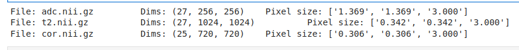

# Exam 1 for ISC_5935 Data Science meets Health Sciences, Spring 2023

The objective of this exam is to evaluate our current learning in the following topics:
*Git and GitHub, Python, Body Planes, and Medical Imaging formats*.

## Question 1 (Git/GitHub 5 Pts)
Create a **new branch** inside and commit this *README.md* file, but where the following sentence has a different style.

Lorem ipsum dolor sit amet, consectetur adipiscing elit. Donec blandit justo ut elit ultrices gravida. 

## Question 2 (Image Planes 8 Pts)
Identify the right Femur inside the *Data/cor.nii.gz* file (ItkSnap or 3DSlider) from a Coronal view.
Similar to the last homework, highlight the identified area with an image editor. 

Save a screenshot of the identified region and added it to your notebook.

*Tip: in T2 MRIs, water will produce bright areas, muscle dark gray areas, and air will be black.*

## Question 3 (Python 8 Pts)
In a jupyter-notebook add a cell that prints the dimensions and size of the pixels, together with 
the name of the file for the 3 files inside the *Data* folder. 

Similar to: 

## Question 4 (Widgets 10 Pts)
In the same jupyter-notebook make an IpWidget that plots the *middle* (or close to middle) slice of the Transverse plane 
for the files *t2.nii.gz* **OR** *adc.nii.gz*, depending on the user selection (you can use dropdown, radio buttons, 
selection, toogle buttons, etc. ).

## Question 5 (Extra 5 Pts)
Include an additional IpWidget that will plot the Transverse plane of the files *t2.nii.gz* and *adc.nii.gz* together. 
Include a slider that allows the user to *move* through the *trans* plane from 0 to 1. 0 will correspond to the
first slice in the plane and 1 will be the last one. In this way, both images will display a similar region even
when they have different dimensions. 